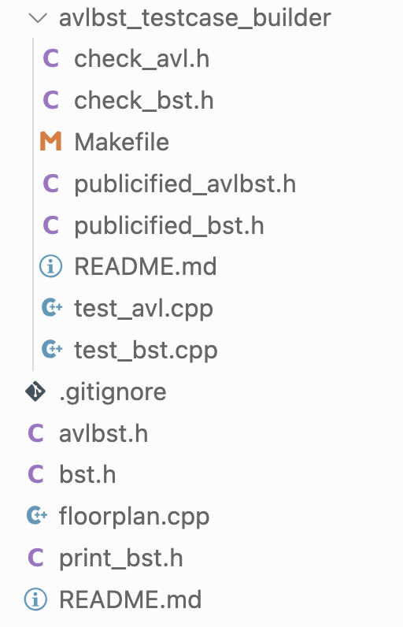

# Setup

Go to the folder `avlbst_testcase_builder` in your `pa4` repository. You can either replace the files `test_avl.cpp` and `test_bst.cpp` with the files of the same name in this git repo (in `./AVL` and `./BST` respectively) or you can copy the contents of those files into your `test_avl.cpp` and `test_bst.cpp` files.

---

# Runtime

Nothing should take a very long time to run. The most time it should take to run a testcase is a few hundred (`200-300`) milliseconds.

--- 

# Questions

You can open an issue/pull request, please let me know if you find any bugs :)